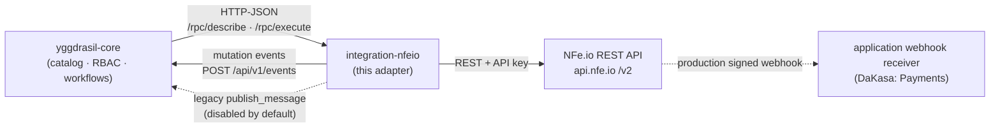
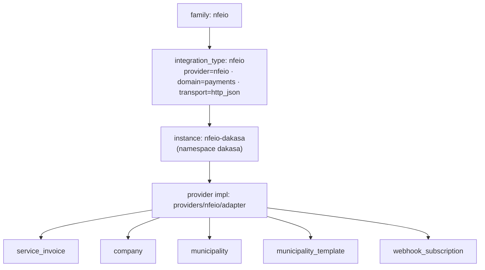
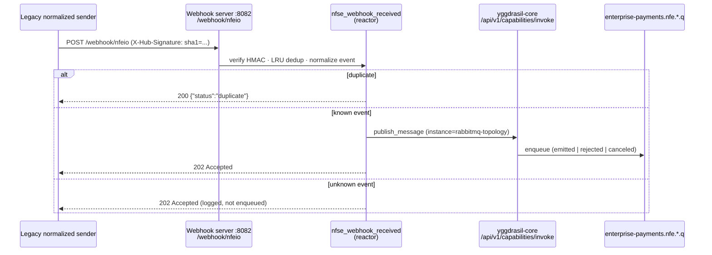

<div align="center">

# integration-nfeio

**Yggdrasil integration adapter for [NFe.io](https://nfe.io) — Brazilian municipal service invoices (NFSe).**

[](./LICENSE)
[](./go.mod)
[](https://github.com/dakasa-yggdrasil/integration-nfeio/pkgs/container/integration-nfeio)

Issue, observe, cancel and reconcile NFSe service invoices through a declarative Yggdrasil integration · [Usage](./docs/USAGE.md) · [Configuration](./docs/CONFIGURATION.md) · [Capabilities](./docs/CAPABILITIES.md) · [Operations](./docs/OPERATIONS.md) · [Development](./docs/DEVELOPMENT.md)

</div>

---

## What it is

`integration-nfeio` is a self-contained Yggdrasil integration worker that wraps the
[NFe.io](https://nfe.io) REST API (`/v2/...`) so you can manage Brazilian municipal
service invoices (NFSe) declaratively. It speaks the standard adapter `describe` /
`execute` contract over HTTP-JSON, exposes 14 callable capabilities across five
resource types (service invoices, companies, municipalities, município templates,
webhook subscriptions), plus a legacy normalized-body reactor that must not be
used as the public NFe.io receiver.

> **Where this fits in Yggdrasil** — Yggdrasil is a self-hosted control plane for
> declarative workflows + integrations over your whole stack (think *Backstage, but
> more complete and scalable*). You write YAML; Yggdrasil persists, runs, and audits
> it. This repo is one **leaf integration adapter**: `yggdrasil-core` owns the catalog,
> RBAC and workflow engine, and calls this adapter's `describe`/`execute` endpoints to
> drive NFe.io. See [`yggdrasil-core`](https://github.com/dakasa-yggdrasil/yggdrasil-core).

## Where it fits



### Integration model



## Capabilities

14 callable capabilities (via `execute`) plus 1 reactor (triggered by the inbound
webhook server, **not** callable via `execute`). All are idempotent. Full I/O
schemas in [docs/CAPABILITIES.md](./docs/CAPABILITIES.md).

| Capability | Resource type | What it does |
|---|---|---|
| `ensure_service_invoice` | `service_invoice` | Issue an NFSe; 409 duplicate → idempotent success |
| `observe_service_invoices` | `service_invoice` | Read one (`{id}`/`{invoice_id}`) or paginate |
| `destroy_service_invoice` | `service_invoice` | Cancel an emitted NFSe; succeeds only once NFe.io reports `Cancelled`, otherwise a retryable `cancellation_pending` error; 404 is an error |
| `retrieve_pdf` | `service_invoice` | Signed PDF download URL (allowlisted helper) |
| `retrieve_xml` | `service_invoice` | Signed XML download URL (allowlisted helper) |
| `bulk_issue` | `service_invoice` | Bulk-issue **up to 50** NFSe, semaphore 5, partial-failure |
| `ensure_company` | `company` | Register a company; 409 already-registered → success |
| `observe_companies` | `company` | Read one (`{id}`) or paginate / filter by tax number |
| `observe_municipalities` | `municipality` | List NFe.io municipalities (cached 1h) |
| `manage_template` | `municipality_template` | Read-only `get` / `list` / `validate` on bundled templates |
| `calculate_iss` | `municipality_template` | Pure-function ISS tax computation (no network) |
| `ensure_webhook_subscription` | `webhook_subscription` | Exact-ID GET/PUT; secures TLS and supports an explicitly confirmed HMAC migration |
| `observe_webhook_subscriptions` | `webhook_subscription` | Read one exact `{id}`; no enumeration |
| `destroy_webhook_subscription` | `webhook_subscription` | Exact-ID delete with matching `confirm_id`; 404 is success |
| `nfse_webhook_received` *(legacy reactor)* | `service_invoice` | Pre-normalized compatibility body only; keep unexposed from NFe.io |

> Capability names follow the Yggdrasil `ensure_/observe_/destroy_` convention.
> The pre-v2.0.0 compatibility aliases were removed at the v3.0.0 major boundary.
> See [CHANGELOG.md](./CHANGELOG.md).

### Mutation events

Every successful ensure or destroy through the reconcilers posts a mutation
event to `yggdrasil-core` (`POST /api/v1/events`) when `YGGDRASIL_CORE_URL` is
set, with `YGGDRASIL_RUN_TOKEN` as the bearer. Emission is best effort: a
refused event logs a WARN and never fails the capability call.

| Event type | Emitted by | `resource_id` |
|---|---|---|
| `nfeio.service_invoice.ensured` | `ensure_service_invoice` | NFe.io invoice `id` |
| `nfeio.service_invoice.destroyed` | `destroy_service_invoice`, only after NFe.io reports `Cancelled` | the cancelled `invoice_id` |
| `nfeio.company.ensured` | `ensure_company` | NFe.io company `id` |
| `nfeio.webhook_subscription.ensured` | `ensure_webhook_subscription` | webhook `id` |
| `nfeio.webhook_subscription.destroyed` | `destroy_webhook_subscription` | webhook `id` |

`instance_id` is the per-call `integration.instance.name` from Core's execute
envelope. The adapter does not bind that name to its credentials: it serves
every envelope with the one NFe.io credential set it was started with. DaKasa
therefore grants the adapter's event principal only `nfeio-dakasa-production`,
and Core refuses events that name any other instance. There is no static
fallback: an envelope without an instance name yields an empty `instance_id`,
which Core also refuses. `destroy_company` is not supported by
NFe.io and `bulk_issue` is an action, so neither emits.

## Quick start

This adapter ships as a container image; there is no bundled `yggdrasil-quickstart.yaml`
or `docker-compose.yml` in the repo. Run the worker directly:

```bash
# 1. Build (or pull ghcr.io/dakasa-yggdrasil/integration-nfeio)
docker build -t integration-nfeio:dev .

# 2. Run — HTTP-JSON transport is the default
docker run --rm \
  -e NFEIO_API_KEY=sk_live_xxx \
  -e NFEIO_WEBHOOK_SECRET=replace_with_32_char_secret_here \
  -p 8080:8080 -p 8081:8081 -p 8082:8082 \
  integration-nfeio:dev

# 3. Verify
curl localhost:8080/healthz          # -> ok
curl localhost:8081/rpc/describe     # -> adapter contract JSON
```

Register it with `yggdrasil-core` by applying the manifests under `manifest/`
(integration type, instance, capabilities) — see [docs/USAGE.md](./docs/USAGE.md).

## Configuration

Two mandatory secrets; the webhook HMAC must contain 32 to 64 characters with
no surrounding whitespace. The rest have safe defaults. Full table in
[docs/CONFIGURATION.md](./docs/CONFIGURATION.md).

| Env var | Required | Secret | Default | Purpose |
|---|:---:|:---:|---|---|
| `NFEIO_API_KEY` | yes | yes | — | NFe.io REST API key |
| `NFEIO_WEBHOOK_SECRET` | yes | yes | - | HMAC-SHA1 secret for inbound webhooks |
| `NFEIO_BASE_URL` | no | no | `https://api.nfe.io` | NFe.io API base URL |
| `NFEIO_COMPANY_ID` | no | no | _(empty)_ | Default company; per-call override allowed |
| `YGGDRASIL_TRANSPORT` | no | no | `http_json` | `http_json` (default) or `amqp` |
| `RPC_PORT` | no | no | `8081` | HTTP RPC port (`/rpc/describe`, `/rpc/execute`) |
| `HEALTHCHECK_PORT` | no | no | `8080` | Health + `/metrics` port |
| `WEBHOOK_PORT` | no | no | `8082` | Inbound webhook port (`/webhook/nfeio`) |
| `YGGDRASIL_CORE_URL` | no | no | _(empty)_ | Core base URL for mutation events (`POST /api/v1/events`); unset disables emission |
| `YGGDRASIL_RUN_TOKEN` | no | yes | _(empty)_ | The adapter's own event publisher bearer for `/api/v1/events`; nothing else reads it |
| `YGGDRASIL_CORE_BASE_URL` | no | no | _(empty)_ | Legacy publish dispatcher URL; the dispatcher is disabled unless this and `YGGDRASIL_WORKFLOW_RUN_TOKEN` are set |
| `YGGDRASIL_WORKFLOW_RUN_TOKEN` | no | yes | _(empty)_ | Legacy publish dispatcher bearer; see the webhook section below |

## Usage

A workflow step issuing a São Paulo NFSe (real capability + município template code):

```yaml
- id: issue-invoice
  uses: integration.nfeio.ensure_service_invoice
  with:
    municipio_code: "3550308"            # São Paulo (bundled template)
    external_id: "order-9c2f"
    borrower_name: "Acme Servicos LTDA"
    borrower_federal_tax_number: 12345678000190
    borrower_address: { street: "Av Paulista", number: "1000", city: "São Paulo" }
    service_amount: 1500.00
    description: "Consultoria de software"
```

Full end-to-end journey (install → configure → first run → verify) in
[docs/USAGE.md](./docs/USAGE.md).

## Webhooks & reactors

> **Not a production NFe.io receiver.** This adapter-local listener still expects
> the legacy normalized `id` / `event` body and does not implement NFe.io's
> current `X-Hook-Id`, `X-Hook-Event`, and signed `payload` state contract. Keep
> port `8082` unexposed. DaKasa production terminates NFe.io callbacks in the
> Payments service.

For legacy normalized callbacks, the adapter's listener (port `8082`, path
`/webhook/nfeio`) HMAC-verifies the body
(`X-Hub-Signature: sha1=<40 hex>`), dedupes (LRU, 4096 entries), normalizes the event to
`{issued | cancelled | processing_failed}`, and publishes to the matching
`enterprise-payments.nfe.*` queue via the `publish_message` capability on the
`rabbitmq-topology` instance.

> **The publish dispatcher is disabled by default.** It posts to
> `/api/v1/capabilities/invoke`, a route `yggdrasil-core` does not have, so an
> enabled dispatcher only gets 404. It is wired only when both
> `YGGDRASIL_CORE_BASE_URL` and `YGGDRASIL_WORKFLOW_RUN_TOKEN` are set. Otherwise
> the adapter logs a WARN at startup and the listener logs and drops each event.
> It never reads `YGGDRASIL_CORE_URL` or `YGGDRASIL_RUN_TOKEN`.



See [docs/CAPABILITIES.md](./docs/CAPABILITIES.md#reactor-nfse_webhook_received) and
[docs/OPERATIONS.md](./docs/OPERATIONS.md#webhook-runbook).

## Operations

- Liveness: `GET :8080/healthz` → always `200 ok`.
- Readiness: `GET :8080/readyz` → always `200 ready` (transport reconnect handled internally).
- Metrics: `GET :8080/metrics` → 7 Prometheus series (`nfeio_*`).

Runbook and failure modes in [docs/OPERATIONS.md](./docs/OPERATIONS.md).

## Development

```bash
go test ./...                              # unit tests
go run ./cmd/lint-action-catalog           # describe/execute/catalog drift gate
go run ./cmd/validate-templates ./manifest/templates/
go vet ./...
docker build -t integration-nfeio:ci .
```

Repo layout, the describe/execute contract, and `pkg/contractcheck` are covered in
[docs/DEVELOPMENT.md](./docs/DEVELOPMENT.md).

## Compatibility

- Go **1.25**.
- `yggdrasil-sdk-go` **v0.9.1** (`adapter`, `webhookhttp`, `sdk/reconcile`, `sdk/events`).
- Adapter version reported by `Describe()`: **3.2.0** (`AdapterVersion` in `providers/nfeio/adapter/spec.go`).
- Transport: HTTP-JSON (default) or AMQP, selected by `YGGDRASIL_TRANSPORT`.

## License

[Apache-2.0](./LICENSE).
