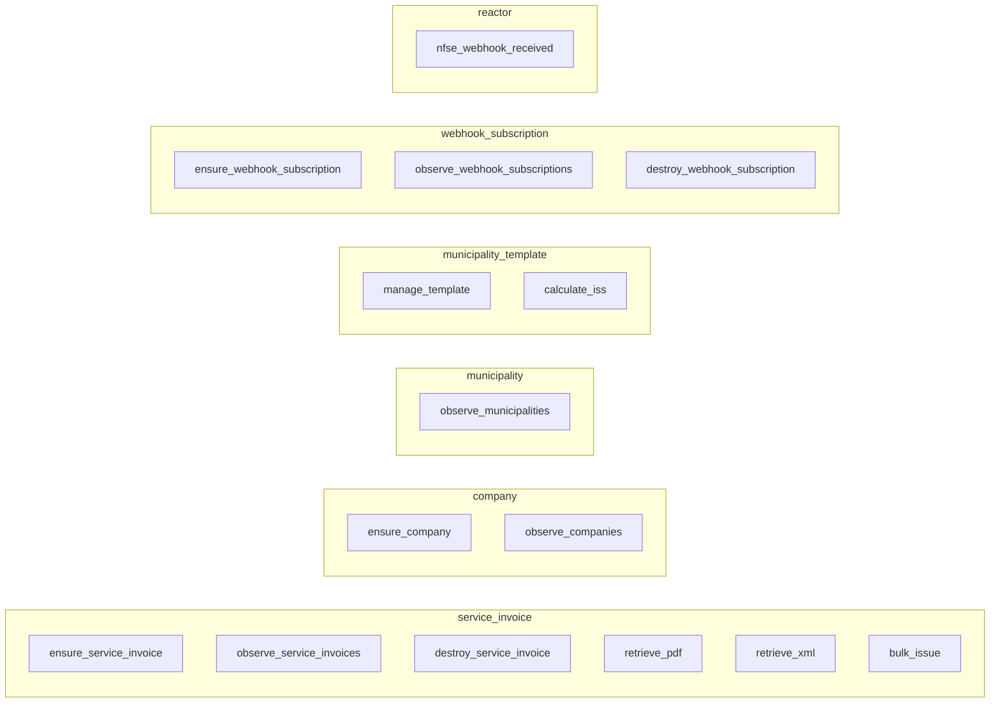

# Capabilities — integration-nfeio

One section per capability, grouped by `resource_type`. Input schemas come from
`manifest/capability.*.yaml`; output shapes and error semantics from
`providers/nfeio/adapter/*.go` and `Describe()` in `spec.go`.
Back to the [README](../README.md).

There are **14 callable capabilities** (`execute`) across five resource types, plus
**1 reactor** (`nfse_webhook_received`) that is triggered by the inbound webhook HTTP
server and is **not** callable via `execute`. All capabilities are `idempotent: true`.

Legacy aliases (`issue_nfse`, `get_nfse_status`, `cancel_nfse`, `register_company`,
`list_municipalities`, and the old webhook create/list/delete names) were removed
at the v3.0.0 major boundary.

---

## Resource: `service_invoice`

Canonical prefix `thirdparty.nfeio.service_invoice` · identity `service_invoice.{external_id}`.

### `ensure_service_invoice`
Issue an NFSe. `POST /v2/companies/{id}/serviceinvoices`. The município template
(by `municipio_code`) supplies the ISS rate + service codes. A 409 duplicate is
decoded into the existing invoice envelope (idempotent success, `duplicate: true`).

- **Required input:** `municipio_code`, `external_id`, `borrower_name`,
  `borrower_federal_tax_number` (integer), `borrower_address` (object),
  `service_amount` (number), `description`.
- **Optional input:** `company_id`, `borrower_municipal_tax_number`,
  `borrower_tax_regime`, `borrower_email`, `issued_on`, `rps_serial_number`,
  `additional_information`, `deductions_amount`, `discount_unconditioned_amount`.
- **Output:** `id`, `status`, `flow_status`, `flow_message`, `external_id`,
  `number`, `check_code`, `iss_tax_amount`, `amount_net`, `created_on`,
  `duplicate` (when the 409-adopt path fired).

### `observe_service_invoices`
Read service invoices. With a `{id}` or `{invoice_id}` filter returns a single-entry
result (`GET /v2/companies/{id}/serviceinvoices/{invoice_id}`); otherwise paginates
`GET /v2/companies/{id}/serviceinvoices`.

- **Input (all optional):** `company_id`, `invoice_id`, `id`, `page_size`, `cursor`.
- **Output:** `items` (array of invoice envelopes) + `cursor` for the next page.

### `destroy_service_invoice`
Cancel an emitted NFSe. `PUT /v2/companies/{id}/serviceinvoices/{invoice_id}/cancel`.
A 422 `cancellation_window_closed` is **terminal** (compensate, don't retry); a 404
is treated as already-absent success.

- **Required input:** `invoice_id`. **Optional:** `company_id`.

### `retrieve_pdf`
`GET /v2/companies/{id}/serviceinvoices/{invoice_id}/pdf` → signed S3 download URL
(`documentUrl`) plus optional expiration. Allowlisted file-URL helper.

- **Required input:** `invoice_id`. **Optional:** `company_id`.

### `retrieve_xml`
`GET /v2/companies/{id}/serviceinvoices/{invoice_id}/xml` → same envelope shape as
`retrieve_pdf`.

- **Required input:** `invoice_id`. **Optional:** `company_id`.

### `bulk_issue`
Bulk-issue **up to 50** NFSe via concurrent `ensure_service_invoice` calls
(semaphore = 5). Partial failures are **not** an error — each result carries its own
status. `> 50` items returns terminal `input_too_large`.

- **Required input:** `items` (array, `maxItems: 50`). Each item carries the
  `ensure_service_invoice` required fields (`municipio_code`, `external_id`,
  `borrower_name`, `borrower_federal_tax_number`, `borrower_address`,
  `service_amount`, `description`).
- **Optional input:** `company_id` (default for items without one), `fail_fast`
  (reserved — the batch always runs to completion).
- **Output:** `results[]` (`index`, `external_id`, `success`, `invoice_id`,
  `status`, `error_code`, `error_message`), `succeeded_count`, `failed_count`
  (the counts always sum to `len(results)`).

---

## Resource: `company`

Canonical prefix `thirdparty.nfeio.company` · identity `company.{federal_tax_number}`.

### `ensure_company`
Register a company at NFe.io for `federal_tax_number`. `POST /v2/companies`. A 409
`already_registered` is decoded into the existing envelope (idempotent success).

- **Required input:** `name`, `federal_tax_number` (integer), `email`, `tax_regime`,
  `address` (object), `login_name`, `login_password` (secret).
- **Optional input:** `trade_name`, `opening_date`, `special_tax_regime`,
  `municipal_tax_number`, `certificate_base64` (secret), `certificate_password`
  (secret).

### `observe_companies`
Read companies. With `{id}` returns a single-entry result (`GET /v2/companies/{id}`);
otherwise paginates `GET /v2/companies`.

- **Input (all optional):** `id`, `federal_tax_number` (integer), `page_size`, `cursor`.

---

## Resource: `municipality`

Canonical prefix `thirdparty.nfeio.municipality` · identity `municipality.{code}`.

### `observe_municipalities`
List municipalities supported by NFe.io. `GET /v2/municipalities`. Cached **1h** per
`(state_code, page, page_size)`; upstream errors trigger a stale-while-error fallback.

- **Input (all optional):** `state_code`, `page` (default `1`), `page_size`
  (default `100`).

---

## Resource: `municipality_template`

Canonical prefix `thirdparty.nfeio.municipality_template` · identity
`municipality_template.{code}`. Backed by the five bundled templates (São Paulo
`3550308`, Rio de Janeiro `3304557`, Curitiba `4106902`, Florianópolis `4205407`,
Belo Horizonte `3106200`).

### `manage_template`
Read-only operations on the in-memory município template catalog. There is no
create/update/delete.

- **Required input:** `operation` — one of `get` (by `municipio_code`), `list`
  (summary), `validate` (against a candidate `yaml_content`).
- **Optional input:** `municipio_code`, `yaml_content`.

### `calculate_iss`
Pure-function helper — computes the ISS tax amount from a município template's rate
(or an override) and a service amount. **No network call.** Formula:
`base = max(0, service_amount - deductions_amount)`, `iss_tax_amount = base * rate`.

- **Required input:** `municipio_code`, `service_amount` (number).
- **Optional input:** `iss_rate_override` (number), `deductions_amount` (number).
- **Output:** `iss_rate` (effective rate used), `base_tax_amount`, `iss_tax_amount`.

---

## Resource: `webhook_subscription`

Canonical prefix `thirdparty.nfeio.webhook_subscription` · identity
`webhook_subscription.{id}`. **New in v2.0.0.**

### `ensure_webhook_subscription`
Reconcile one webhook that already exists at NFe.io. The adapter performs an exact
`GET /v2/webhooks/{id}`. If and only if the provider object has
`insecureSsl=true`, it sends an exact-ID `PUT` with that field changed to `false`,
preserves every other field, then confirms the result with another exact-ID GET.
It never POSTs, lists, matches by URI, or adopts by mutable attributes.

For a one-time security migration, the same capability can copy the HMAC already
projected as the adapter runtime credential into the provider object and remove
every case variant of the legacy `Authorization` callback header. This path is
enabled only when all three fields below are present and the confirmation ID
exactly matches `id`. A partial request fails before any provider call. Because
NFe.io does not return the HMAC after write, a successful PUT plus the exact-ID
confirmation proves TLS and legacy-header removal; a provider-signed receiver
canary remains the operational proof that the HMAC itself is active.

- **Required input:** `id`, `insecure_ssl` (must be `false`).
- **Optional atomic security migration:** `set_hmac_from_runtime=true`,
  `remove_legacy_authorization=true`, and `confirm_security_migration_id` equal
  to `id`. Supplying any subset is rejected.
- **Output:** `id`, `insecure_ssl`, `adopted`, and `updated` only.
- **Secret boundary:** provider `secret`, `uri`, `headers`, `properties`, raw
  payload, and future unknown fields are never returned in resources, adoption
  responses, events, errors, or logs.

### `observe_webhook_subscriptions`
Read one webhook with an exact-ID `GET /v2/webhooks/{id}`. Empty filters, cursors,
listing, discovery, and attribute-based adoption are deliberately rejected.

- **Required input:** `id`.
- **Output:** one minimal item with `id` and `insecure_ssl`; no provider secrets or
  raw configuration.

### `destroy_webhook_subscription`
Delete one exact webhook only when the caller supplies the same provider ID twice.
`DELETE /v2/webhooks/{id}` treats 404 as already-absent success. This capability is
not in `webhook_subscription.default_actions`, so a normal reconcile cannot select
it implicitly.

- **Required input:** `id`, `confirm_id` (must exactly equal `id`).

---

## Reactor: `nfse_webhook_received`

Category `reactor`, resource type `service_invoice`. **Not callable via `execute`** —
it is triggered by the inbound webhook HTTP server (port `8082`, path
`/webhook/nfeio`).

Pipeline (see `providers/nfeio/adapter/webhook_server.go`):

1. Read the raw body once, then verify `X-Hub-Signature-256` (falls back to
   `X-Hub-Signature`) as HMAC-SHA256 over those exact bytes using
   `NFEIO_WEBHOOK_SECRET`. Invalid → `401`.
2. Dedupe by event `id` (LRU, 4096 entries); falls back to a SHA-256 body hash when
   the payload has no `id`. Duplicate → `200 {"status":"duplicate"}`.
3. Normalize the polymorphic NFe.io event vocabulary to one of `issued`,
   `cancelled`, `processing_failed`.
4. Map the normalized state to a queue and publish the raw body via the
   `publish_message` capability on the `rabbitmq-topology` instance, routed through
   `yggdrasil-core` (`POST /api/v1/capabilities/invoke`). Success → `202 Accepted`.
   Unknown event → `202` (logged, not enqueued — avoids an NFe.io retry storm).

| Normalized status | Target queue |
|---|---|
| `issued` | `enterprise-payments.nfe.emitted.q` |
| `processing_failed` | `enterprise-payments.nfe.rejected.q` |
| `cancelled` | `enterprise-payments.nfe.canceled.q` |

See the sequence diagram in the [README](../README.md#webhooks--reactors) and the
[webhook runbook](./OPERATIONS.md#webhook-runbook).
</content>
